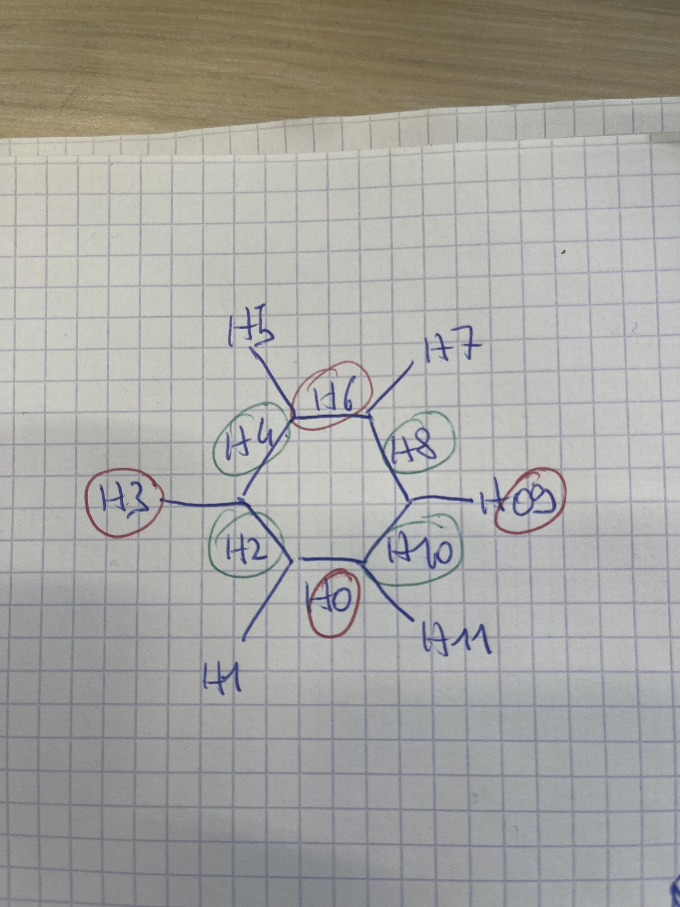
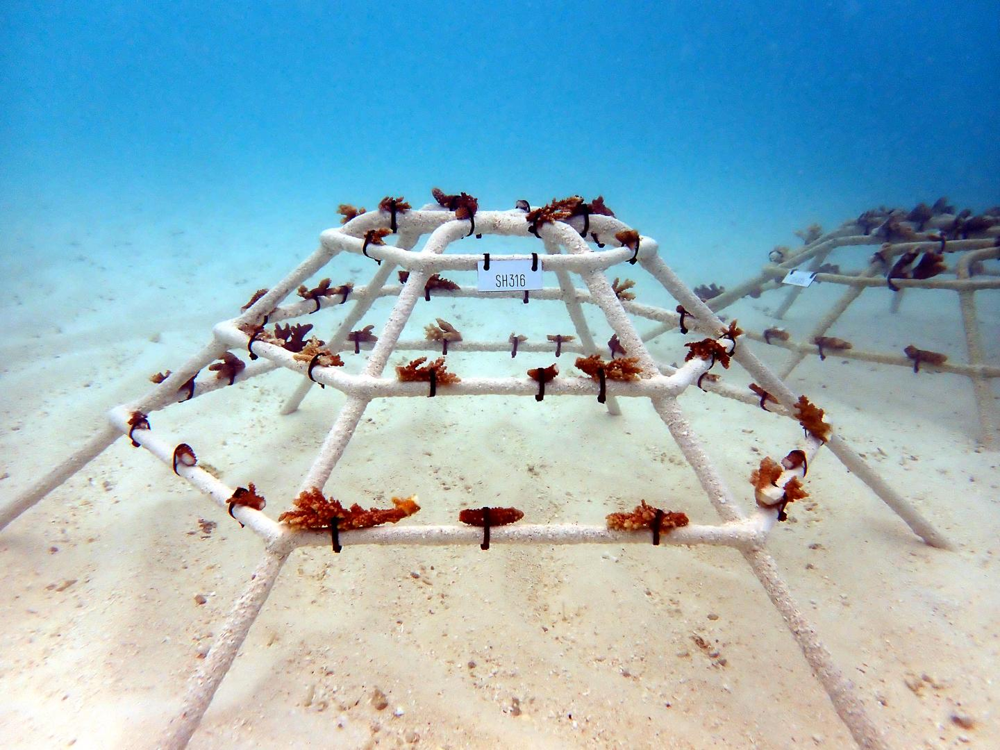

# Explications MCD
les sections comportant un "?", nécessitent davantage d’informations (à demander à TCP si nous n’avons pas trouvé avant).
La plupart du contenu des tables est autoalimenté via l'ia qui détecte l'emplacement des fragments et leur état sur les photos. Vous trouvez ces colonnes remplies automatiquement grâces aux requêtes commençant par '**INSERT INTO**' dans le fichier sql.sql.

## annotations : 

Répertorie tous les fragments de corail détectés sur chaque image de surveillance. Ceci est spécifique à un **cadre**, une **date** et une **vue**.

-**AnnotationID**: auto incrémentée, l’id de l’annotation

-**ObservationId** : clé secondaire issue de la table observations. 

-**MonitoringPicture** : l’image qui permet de faire la notation (pour un fragment donné).

-**Type** : le résultat de la classification (parmi : Acropora, Pocillopora, Bleached, dead et frame tag (la structure sans les coraux.)

-**Score** : mesure le score de précision de la reconnaissance des coraux (classification).Sont insérés dans la base les résultats ayant atteint la valeur de seuil (0.8) à ceux ayant atteint 0.99.

-**TopLeftX**, **TopLeftY**, **Witdh**, **Height** : taille et position des bbox.

-**Updated** : ajout de la date au moment où les données sont inscrites dans la bdd.

## fragments :

C’est la table qui permet les relations principales avec les autres. Elle contient les observations, consolidées pour toutes les dates. C'est spécifique à un cadre, et c'est tout. Chaque fragment est lié à une ou plusieurs observations.
 

-**FragmentedID** : est généré automatiquement pour chaque corail

-**Tag** : numéro de récif

-**Bar** : elles correspondent à la face et aux barres de chaque récifs. Vous avez 6 faces par récifs. Numérotées de H00 (là ou il y a l'étiquette) à H10 en partant par la gauche. (cf *schéma 1*). Voici les faces dans l'ordre (aidez vous d'une image de récif et du *schéma 1* afin de mieux comprendre.)

|  |
|  |

-**Position** : position du fragment sur la bar. Elles se situent entre 0 (extrémité gauche) et 1 (extrémité droite).

-**Type** : le type de corail reconnu 

-**Transplanted** : la date de détection initiale, pour les faces H0 et H6, elle se fait quelques jours après la transplantation effective du fragment. A noter : sur les cadres reconstitués, la première détection peut avoir lieu entre 0 et 6 mois après la transplantation effective (au moment de la surveillance.)

-**Dead** : si un décès ou une perte est observée, l’annotation est la date médiane entre la dernière annotation vivante et la première observation du décès.

-**Updated** : est auto incrémenté sur la date du jour.

## frameparams :

-**MonitorinPicture** : nom de la photo, elle se compose du tag, de la bar, et la date de la prise de la photo, vous pouvez obtenir plus d'informations sur les angles de prises de vue des photos via le *schéma 1*.

-**Score** : utiliser pour recouper les photos entre elles. Vérifie si la barre avec le fragment 1 peut être une plus ancienne version de la bar avec le fragment 2 (c'est-à-dire si les coraux se sont déplacés ou re-plantés?). _non utilisé pour le moment ? Tant que le score est supérieur à 18, l’algorithme essaie de le faire diminuer. 

-**Rx**, **RY**, **RZ** : données pour le calcul de l'angle de la prise de vue.

-**Scalling**, **Tu**, **Tv** : informations sur la luminosité, le flou et l’échelle de l’image (?)

-**Updated** : date du jour au moment de rentrer la ligne de données

## fsframes :

Liste des récifs

-**Tag** : correspond à la plaque noté sur le récif

-**Resort** : hôtels sont où plantés les coraux 

-**Type** : taille de la structure 

-**Zone** : lieu où est planté le corail

-**latitude** et **longitude** du corail

-**Depth** : indice de profondeur (unité de mesure?)

-**transplanted** : date de la détection initiale (= date de la première surveillance, qq jours après avoir été planté. Sauf pour les cadres reconstitués ou cela peut survenir dans les 0 à 6 mois. )

## fsmonitoring : 

Liste des sessions de surveillance, avec les noms de fichiers d'image associés.

-**ID** : se compose du numéro de récif +la date à laquelle la photo a été prise.

-**Tag** : numéro du récif

-**Date Code** : date de prise de la photo

-**View1** , **View1**, **View1**, **View1** : se compose du numéro de récif + de l’angle de prise de vue de la photo +la date à laquelle la photo a été prise.

## Observations : 

Ce sont les annotations, consolidées pour l'ensemble du cadre. Elle est spécifique à une trame et à une date mais pas à la vue. Chaque observation est liée à une ou deux annotations. A priori cette table est utilisée lorsqu’il y a un changement sur le fragment de corail. Elle **permet d’obtenir des informations sur l’évolution de la hauteur et de la largeur des fragments de coraux.**

-**ObservationID** : c’est l’id de l’observation, auto incrémenté

-**FragmentID** : l’id du fragment, issu de la table fragments 

-**Tag**: numéro de récif

-**Date** : date de la surveillance

-**Type** : résultat de la classification

-**AdjHeight** : adjustable height, hauteur, mesure effectuée à partir de la barre de cadre afin d’éviter des soucis de distorsion ou de perspective

-**AdjWidth** : adjustable width, largeur, même commentaire

-**Bar** : position sur le récif

-**Position** : position sur la bar

-**Upload** : date de mise à jour des informations, auto incrémentée (année/mois/jour/heure/minutes/seconde), ça date de plus de 2 ans maintenant

## Status

Statut de chaque fragment à chaque date de surveillance (à partir de la première détection.)

-**FragmentID** : issu de la table Fragments

-**ObservationID** : issu de la table Observations

-**Type** : type de corail, résultat de classification, un autre type “fallen” à été ajouté. Il ne figure pas parmi les types de la table annotations. 

-**Date** : date de la dernière détection

-**Days** : nombre de jours écoulés depuis la première détection

-**Updated** : date du jour où les infos sont entrées, auto incrémenté

